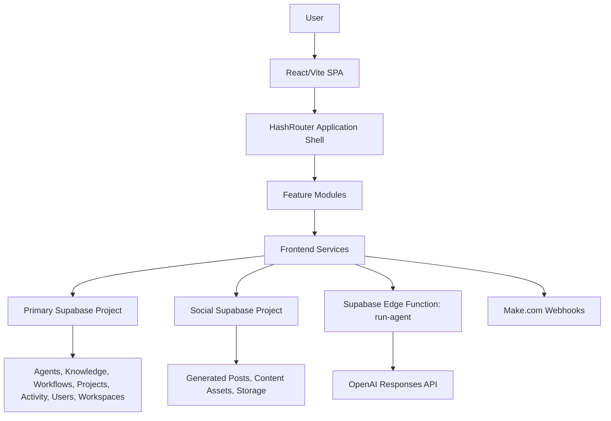

# Fractal AI / Nexus Prime Project Report

Prepared: July 17, 2026

## Executive Summary

Fractal AI, currently branded throughout the UI as Nexus Prime, is a React and Vite single-page application for operating an AI-enabled business platform. The product combines agent management, agent execution, knowledge management, multi-agent workflows, social content distribution, project tracking, analytics, workspace management, integrations, and super-admin controls.

The project is feature-rich and has a substantial frontend implementation. The strongest areas are the application shell, agent management experience, workflow builder, social distribution center, and Supabase-backed service structure. The core runtime path for AI work is also clear: frontend services gather agent context, call a Supabase Edge Function, and persist activity and conversation records.

The project is not yet production-hardening complete. The production build succeeds, but lint currently fails with 29 errors and 6 warnings. Several important features are implemented at the UI/service level but are incomplete or mismatched at the backend boundary. The most important readiness gaps are custom client-side auth, unverified Edge Functions, partial workspace isolation, social Edge Functions that are still starter stubs, no automated tests, stale README documentation, and mismatch between the UI's promised agent capabilities and what the `run-agent` Edge Function actually consumes.

## Project Identity

- Repository directory: `C:\Users\iamku\fractal-ai-restore`
- Package name: `fractal-ai`
- Primary UI brand: Nexus Prime
- Legacy/source brand references: Fractal AI
- Social module brand reference: Sovereign Solutions
- Product category: AI operating system / internal operations platform
- Target users: operators, founders, marketers, sales teams, admin users, and AI-assisted business teams

The repo is in the middle of a brand transition. Local storage keys, UI copy, CSS comments, package metadata, and module names include a mix of `fractal`, `nexus`, and `sovereign`. This is manageable, but it should be cleaned up before external release because it affects user trust, documentation, analytics, support, and onboarding.

## Technology Stack

### Frontend

- React 19.2.6
- Vite 8.0.12
- React Router 7 with `HashRouter`
- Framer Motion for transitions and animation
- Lucide React for icons
- Recharts for analytics charts
- React Hot Toast for notifications
- React Dropzone for file upload UX
- JSZip and FileSaver for social export and document ingestion workflows

### Backend and Data

- Supabase JavaScript client
- Supabase tables accessed directly from frontend services
- Supabase Edge Functions using Deno
- OpenAI Responses API called from the `run-agent` Edge Function
- Make.com webhooks used by the Social Distribution module

### Tooling

- ESLint 10 flat config
- TypeScript config with `allowJs: true`, `strict: false`, and `noEmit: true`
- Vercel config with a frame ancestor CSP header
- No automated test framework is currently configured

## Repository Structure

```text
src/
  App.jsx
  main.jsx
  core/
    database/supabase.ts
    workspace/WorkspaceContext.jsx
  pages/
    Auth.jsx
    Applications.jsx
  shared/components/
    Sidebar.jsx
    Topbar.jsx
    CommandCenter.jsx
    AskFractal.jsx
    Onboarding.jsx
    ErrorBoundary.jsx
    Skeleton.jsx
  services/
    authService.ts
    sessionService.js
    adminService.js
    agentService.js
    knowledgeService.js
    openaiService.js
    orchestratorService.js
    toolRegistry.js
    activityService.js
    workspaceService.js
  apps/
    admin/
    agents/
    analytics/
    command/
    content/
    dashboard/
    integrations/
    knowledge/
    projects/
    settings/
    social/
    workflows/
    workspace/
supabase/
  config.toml
  functions/
    run-agent/
    generate-posts/
    publish-post/
    social-analytics/
```

The organization is generally sensible. Cross-cutting services live under `src/services`, while module-specific services live inside `src/apps/<module>/services`. This makes the application easy to scan and gives each product surface a clear home.

## Application Architecture

### Routing and Shell

The root application uses `HashRouter`, which is appropriate for static deployments where server-side routing rewrites are not guaranteed. The route tree is split into a public `/auth` route and a protected application layout.

Primary protected routes:

- `/` - Dashboard / Mission Control
- `/applications` - application launcher
- `/workspace` - active workspace overview
- `/agents` - agent management
- `/run-agent` - persistent agent chat
- `/multi-agent` - sequential multi-agent workspace
- `/marketplace` - installable agent templates
- `/workflows` - AI workflow builder and runner
- `/projects` - project tracker
- `/knowledge` - knowledge base
- `/social-distribution` - social content review and publishing center
- `/content-assets` - content asset creation
- `/integrations` - external service configuration
- `/analytics` - usage analytics
- `/settings` - profile, workspace, backend settings
- `/command` - natural language command orchestrator
- `/admin` - super-admin panel, conditionally exposed

`ProtectedLayout` checks for a local session synchronously via `getSession()` and redirects unauthenticated users to `/auth`. The layout wraps the main app in `WorkspaceProvider`, `Sidebar`, `Topbar`, `CommandCenter`, and `ErrorBoundary`.

### State Management

The project mostly uses local React state plus a single workspace context:

- `WorkspaceContext` loads workspaces from Supabase.
- The active workspace is stored in local storage.
- Session data is stored in local storage.
- Feature pages fetch their own data directly through service modules.

There is no global data cache, query library, optimistic mutation framework, or centralized store. That keeps the implementation approachable, but repeated fetching, stale state, and inconsistent loading/error behavior will become harder to manage as usage grows.

### Data Access Pattern

Most browser services query Supabase directly using the anon client. This means Row Level Security, table policies, and validation are critical. The frontend assumes tables exist and mostly handles missing or blocked data with fallbacks or empty arrays.

The main exception is AI execution, which goes through the `run-agent` Supabase Edge Function rather than calling OpenAI directly from the browser.

## Core Product Modules

### Dashboard

The dashboard acts as Mission Control. It shows:

- installed agent count
- agent run count
- token usage
- estimated cost
- recent activity
- application shortcuts
- static system health cards

Data comes from `getAgents`, `getAnalytics`, and `getActivityLogs`. The health indicators are currently static UI labels, not real connectivity checks.

### Applications Launcher

The application launcher presents nine modules with counts from Supabase where available:

- AI Agents
- Agent Marketplace
- Knowledge Base
- Workflows
- Social Distribution
- Analytics
- Projects
- Integrations
- Workspace

This page is useful as a product navigation hub. It also reveals that several modules are intended to feel like first-class apps rather than hidden settings pages.

### Agent Management

Agent management is one of the strongest areas in the project. Users can:

- create agents
- edit name, role, description, model, system prompt, and status
- clone agents
- delete agents
- view overview details
- manage agent memory
- inspect recent execution logs
- open an agent in the runner
- install template agents from the marketplace

Agent templates cover operations, sales, marketing, research, engineering, and support. The marketplace is implemented as local static template data and creates rows in the `agents` table.

Important limitation: the UI allows users to configure `model` and `system_prompt`, but the current `run-agent` Edge Function always calls `gpt-4.1-mini` and builds its own system prompt from only `agent.name` and `agent.role`. The agent's custom system prompt and selected model are not honored at the backend boundary.

### Agent Runner

The agent runner supports:

- selecting an agent
- selecting workspace and client context
- persistent chat threads
- chat message persistence
- memory toggle per thread
- image attachment preview via paste, drag/drop, or file picker
- automatic thread creation

The UI is ahead of the backend here. Image attachments are previewed and noted in the prompt, but `runAgent` currently accepts only `(agent, prompt)` and the Edge Function does not process image payloads. Thread memory can be toggled, but the broader `runAgent` service always fetches the agent's recent conversations and memory; the thread-level memory setting only changes a note appended to the prompt.

### Multi-Agent Workspace

The multi-agent workspace allows users to select multiple agents and run them sequentially against a shared task. Each selected agent receives the original task and accumulated context from previous agents.

This is a practical first version of multi-agent collaboration. It is sequential, not parallel. It does not yet persist team runs as first-class records, and it relies on the same `runAgent` backend limitations described above.

### Workflows

The workflows module supports:

- creating workflows
- adding workflow steps
- assigning each step to an agent
- editing step name, instruction, and agent
- deleting steps
- running workflows with input
- recording workflow runs
- viewing recent run output

The workflow engine fetches agents and workflow steps, then chains `runAgent` calls. Each step output becomes the context for the next step. Completed runs are inserted into `workflow_runs` and logged to `activity_logs`.

Implementation gaps:

- Step reorder UI imports Framer Motion `Reorder`, but actual reorder persistence is not implemented.
- Workflow execution is synchronous in the browser path and could be fragile for long-running workflows.
- There is no failed-run persistence path.
- Workflows are not scoped to workspace in current service queries.

### Knowledge Base

The knowledge module supports:

- writing entries manually
- uploading TXT, MD, CSV, JSON, DOCX, and simple PDFs
- extracting URL content through the AllOrigins proxy
- tagging entries
- assigning entries globally or to a specific agent
- searching and filtering by type
- paginated grid display
- deleting entries

The knowledge service exposes both global retrieval and agent-aware retrieval. `getKnowledgeForAgent` returns items where `agent_id` matches the selected agent or is null.

The file ingestion logic is useful, but PDF extraction is intentionally basic and may fail on many real-world PDFs. DOCX extraction is custom XML stripping and may miss formatting, tables, headers, footers, and complex document content.

### Command Center

The command center is a natural language orchestration surface. The flow is:

1. User enters a natural language request.
2. `orchestratorService` builds a system prompt containing available tool definitions.
3. The `run-agent` Edge Function is invoked using a synthetic "Nexus Orchestrator" agent.
4. The model returns a JSON plan.
5. The frontend parses the plan and executes registered tools from `toolRegistry`.
6. Results are displayed step-by-step and logged.

Available tools include agent listing/running/creation, knowledge search/add, project creation, workflow creation, analytics retrieval, activity retrieval, content asset creation, social post listing, and workspace management.

This is a compelling product feature, but it is also a high-risk trust boundary because model output determines which tools run. Tool execution should eventually move server-side with authorization, input validation, audit logs, and allowlisted actions per user role.

### Social Distribution Center

The social distribution module is the largest feature area. It supports:

- polling generated posts every 30 seconds
- loading content assets
- filtering by status, platform, and search text
- selecting posts
- editing post body
- saving edits
- rejecting posts
- scheduling posts
- sending schedule payloads to Make.com
- creating content assets
- uploading images to Supabase Storage
- attaching images to generated posts
- bulk reject and delete
- ZIP export of visible or selected posts
- platform-style previews
- social analytics charts
- local activity feed

The data service uses a second Supabase client configured through:

- `VITE_SOCIAL_SUPABASE_URL`
- `VITE_SOCIAL_SUPABASE_ANON_KEY`
- `VITE_MAKE_GENERATE_WEBHOOK`
- `VITE_MAKE_SCHEDULE_WEBHOOK`

This differs from the repo guidance in `AGENTS.md`, which says the social client has hardcoded credentials. The current implementation is env-var driven.

Important limitation: the Supabase Edge Functions named `generate-posts`, `publish-post`, and `social-analytics` are still starter "Hello from Functions" stubs. The real social automation path is currently frontend to Supabase tables/storage plus frontend-triggered Make.com webhook calls.

### Content Assets

The Content Assets page is a simplified asset library and creation flow that uses the same social service. Users can:

- create content assets
- attach an image
- trigger Make.com post generation
- search asset records
- view source links and images

This overlaps with `AssetCreator` inside Social Distribution. The duplication is acceptable for now, but the product should eventually clarify whether Content Assets is a standalone module or just an entry point into Social Distribution.

### Projects

The projects module supports:

- creating projects
- adding descriptions, GitHub URL, local path, and launch commands
- filtering by status
- changing status
- deleting projects
- logging project activity

The Launch button currently displays the command in a toast rather than executing it. That is safer for a browser app, but the UI copy may lead users to expect a real launch action.

### Workspace

Workspace support includes:

- workspace loading and selection
- local storage persistence
- fallback workspace if data is unavailable
- workspace overview page
- workspace switcher in the sidebar
- workspace CRUD under Settings

The concept is strong, but workspace isolation is partial. Many services fetch all rows without filtering by `workspace_id`, including agents, projects, knowledge, workflows, analytics, and activity logs. Client selection in the agent runner is workspace-filtered, and chat threads store workspace/client IDs, but most module data is still globally queried.

### Analytics

Analytics are derived from `activity_logs`, especially `agent_run` records. The analytics service calculates:

- total runs
- total tokens
- estimated cost
- daily run/token/cost series
- runs by agent

The dashboard and analytics pages depend on metadata being consistently written by `runAgent`. Errors are currently reported as zero because failure events are not tracked in the analytics service.

### Integrations

The integrations page supports saving config for:

- OpenAI
- Supabase
- Gmail
- WordPress
- Make.com
- Zoho
- Discord
- Claude

The UI masks stored secrets after saving. However, configs are saved from the browser directly into a Supabase `integrations` table. Unless the table is protected with strong RLS and encryption, this is not safe for real API secrets. Production integrations should route secret writes through a server-side function or secret manager.

### Settings

Settings include:

- profile information from local storage session
- sign out and clear local data
- platform overview
- active workspace display
- workspace CRUD
- backend status cards

The backend status cards are static indicators rather than real checks. The logout route uses `window.location.hash = "/login"`, but the app's auth route is `/auth`. The subsequent reload likely still resolves through the protected layout, but the route target should be corrected.

### Super Admin

The admin module supports:

- listing users from `app_users`
- deleting users
- promoting/revoking super admin status
- showing online count
- showing session history
- showing total tracked session time

The route is conditionally registered based on `is_super_admin` in the local session. Real enforcement depends entirely on Supabase RLS and RPC/table policies. Client-side route hiding is not sufficient authorization.

## Data Model Inferred From Code

The frontend references the following Supabase tables:

- `app_users`
- `activity_logs`
- `agents`
- `agent_memory`
- `agent_conversations`
- `agent_chat_threads`
- `agent_chat_messages`
- `knowledge`
- `workspaces`
- `clients`
- `projects`
- `workflows`
- `workflow_steps`
- `workflow_runs`
- `integrations`
- Social project: `generated_posts`
- Social project: `content_assets`

The social storage bucket is:

- `content-assets`

There are no full SQL migration files in the visible repo. `migration-inventory.txt` and `migration-imports.txt` appear to be inventory/support files, not executable schema migrations. For production readiness, the database schema, RLS policies, indexes, seed data, and Edge Function secrets should be documented and versioned.

## Key Runtime Flows

### Authentication Flow

1. User enters username/password on `/auth`.
2. `loginUser` or `registerUser` calls Supabase RPC:
   - `login_app_user`
   - `register_app_user`
3. Session payload is stored in local storage under `nexus_user`.
4. Session includes `_issued_at` and `_expires_at`.
5. `ProtectedLayout` allows access if `getSession()` returns a valid payload.
6. Session tracking writes online status and session events through `adminService`.

This is not Supabase Auth. It is a custom username/password system. That can be valid, but it requires careful server-side password handling, RPC policies, session invalidation strategy, brute-force protection, and authorization checks.

### Agent Execution Flow

1. UI selects an agent and prompt.
2. `openaiService.runAgent` loads:
   - agent knowledge
   - recent agent conversations
   - agent memory
3. It formats knowledge, history, and memory.
4. It invokes Supabase Edge Function `run-agent`.
5. Edge Function calls OpenAI Responses API.
6. Frontend saves conversation to `agent_conversations`.
7. Frontend logs activity to `activity_logs`.

Important mismatch: `openaiService.runAgent` sends `memory`, but the Edge Function only destructures `agent`, `prompt`, `knowledge`, and `history`. Memory is not inserted into the OpenAI request.

### Workflow Execution Flow

1. User creates a workflow and step records.
2. User enters workflow input and clicks Run.
3. `executeWorkflow` loads all agents and the workflow's steps.
4. For each step:
   - find assigned agent
   - build a step prompt
   - call `runAgent`
   - append output to the full workflow result
   - pass step output as next context
5. Persist final result in `workflow_runs`.
6. Log activity.

This is easy to reason about, but long workflows could exceed browser runtime expectations. A server-side workflow runner would be safer.

### Social Distribution Flow

1. User creates a content asset.
2. Optional image uploads to Supabase Storage.
3. Content asset is inserted into social Supabase `content_assets`.
4. Frontend posts to Make.com generate webhook.
5. Generated posts appear in social Supabase `generated_posts`.
6. UI polls every 30 seconds.
7. User edits, rejects, schedules, or exports posts.
8. Scheduling updates the post and posts to Make.com schedule webhook.

The product flow is clear and practical. The operational risk is that Make.com webhook URLs are exposed to the browser as `VITE_` variables, so abuse prevention must happen in Make.com, Supabase RLS, or a server-side proxy.

### Command Orchestration Flow

1. User enters a natural language command.
2. Orchestrator LLM generates a JSON plan.
3. Frontend parses the plan.
4. Frontend executes tool functions from `toolRegistry`.
5. Results are shown in the command UI and logged.

This is powerful, but high-risk. Model-directed tool execution should be tightly permissioned, especially for create/delete/admin operations.

## Environment and Deployment

`.env.example` defines:

```text
VITE_SUPABASE_URL=
VITE_SUPABASE_ANON_KEY=
VITE_OPENAI_API_KEY=
VITE_SOCIAL_SUPABASE_URL=
VITE_SOCIAL_SUPABASE_ANON_KEY=
VITE_MAKE_GENERATE_WEBHOOK=
VITE_MAKE_SCHEDULE_WEBHOOK=
```

The browser app uses the Supabase and social variables. The `run-agent` Edge Function expects `OPENAI_API_KEY` in the Supabase Edge Function environment, not `VITE_OPENAI_API_KEY`. The example file should clarify that browser `VITE_OPENAI_API_KEY` should not be needed for the current implementation and should not be exposed in production.

`vercel.json` configures only:

- `Content-Security-Policy: frame-ancestors 'self' https://soveraign.solutions https://*.soveraign.solutions`

The app uses `HashRouter`, so Vercel rewrites are not required for route refreshes.

## Build and Validation Status

### Production Build

Command:

```bash
npm.cmd run build
```

Result: success after allowing Vite to write temporary files under `node_modules/.vite-temp`.

Build output:

- `dist/index.html`: 0.74 kB, gzip 0.40 kB
- CSS bundle: 95.35 kB, gzip 14.58 kB
- JS bundle: 1,368.70 kB, gzip 394.39 kB

The JS bundle is large enough that route-level code splitting should be considered, especially because this is a multi-module app where users may not need every module during a session.

### Lint

Command:

```bash
npm.cmd run lint
```

Result: fails with 29 errors and 6 warnings.

Main categories:

- unused imports and unused variables
- React hook dependency warnings
- React Compiler/React 19 lint rules around synchronous state updates in effects
- React purity lint for `Date.now()` during render
- Fast refresh export rule in `WorkspaceContext`

Representative files:

- `src/apps/agents/pages/AgentRunner.jsx`
- `src/apps/agents/pages/Agents.jsx`
- `src/apps/analytics/pages/Analytics.jsx`
- `src/apps/knowledge/pages/Knowledge.jsx`
- `src/apps/social/pages/SocialDistribution.jsx`
- `src/shared/components/CommandCenter.jsx`
- `src/core/workspace/WorkspaceContext.jsx`

### Tests

No automated tests are configured. `AGENTS.md` also states there are no automated tests in this project.

Recommended initial test coverage:

- service-level unit tests for formatting and data transformations
- auth/session local storage behavior tests
- workflow engine tests with mocked `runAgent`
- command orchestrator plan parsing tests
- social service payload construction tests
- a small Playwright smoke suite for login, navigation, agent creation, knowledge creation, and social queue rendering

## Strengths

- Clear modular folder structure by feature area.
- Substantial product surface already implemented.
- Strong visual identity and polished application shell.
- Good use of Supabase service wrappers rather than embedding all queries in components.
- Agent management and marketplace are coherent and practical.
- Workflow builder has a straightforward mental model.
- Social Distribution Center is operationally detailed and includes review, preview, scheduling, analytics, export, and bulk actions.
- Activity logging creates a foundation for analytics and auditability.
- Edge Function boundary keeps OpenAI API calls out of the browser.
- Hash routing simplifies static hosting.
- Workspace concept provides a foundation for multi-client/multi-tenant use.

## Primary Risks and Gaps

### 1. Authentication and Authorization Need Hardening

Auth is custom and session state is stored in local storage. Protected routes and super-admin visibility are client-side checks. Supabase RLS and RPC policies must enforce all real permissions. Edge Functions currently have `verify_jwt = false`, and `run-agent` uses wildcard CORS.

Recommended actions:

- audit all Supabase RLS policies
- require authenticated context or signed server tokens for Edge Functions
- move privileged operations out of browser-direct table writes
- add rate limiting for AI execution
- enforce admin permissions server-side

### 2. Agent Configuration Is Not Fully Honored

The UI stores `model` and `system_prompt`, but the Edge Function always uses `gpt-4.1-mini` and ignores `agent.system_prompt`. It also ignores `memory`.

Recommended actions:

- pass `agent.model` to the OpenAI request with an allowlist
- include `agent.system_prompt` in the system prompt
- include formatted memory in the OpenAI input
- record the actual model used in activity logs
- add tests for prompt assembly

### 3. Image Chat Is UI-Only

Agent Runner supports image attachments visually, but the backend does not process images. The third argument passed to `runAgent` is ignored.

Recommended actions:

- either remove image claims from the UI until supported
- or update `runAgent` and `run-agent` to send multimodal content to a vision-capable model
- persist image references in storage rather than base64 in component state

### 4. Workspace Isolation Is Partial

The selected workspace exists in context, but many queries are global. This can leak or mix data across clients/workspaces.

Recommended actions:

- add `workspace_id` to relevant tables
- update services to filter by active workspace
- backfill existing records
- enforce workspace RLS policies
- update analytics to scope by workspace

### 5. Social Backend Boundary Is Incomplete

The Social Distribution UI is detailed, but Supabase functions for generating, publishing, and analytics are stubs. Make.com webhooks are called from the browser.

Recommended actions:

- implement or remove stub Edge Functions
- route webhook calls through server-side functions
- validate payloads
- authenticate webhook triggers
- add retry/error state for failed Make.com calls

### 6. Documentation Is Stale

`README.md` is still the default Vite template. `AGENTS.md` contains helpful architecture notes but is not user-facing and has at least one stale claim about the social client being hardcoded.

Recommended actions:

- replace README with project-specific setup, architecture, env, and deployment docs
- document required Supabase schema and Edge Function secrets
- add a quickstart for local development
- document Make.com setup
- document common troubleshooting, including PowerShell `npm.ps1` execution policy and `npm.cmd`

### 7. Lint and Test Health Are Not Release-Ready

Production build succeeds, but lint fails and no tests exist. This makes refactoring risky.

Recommended actions:

- decide whether to keep React 19 compiler-oriented lint rules or tune ESLint
- fix unused imports/variables first
- add focused smoke tests
- add CI for `npm run lint` and `npm run build`

### 8. Secret Handling Needs Review

The Integrations page saves API keys from the browser. Make.com webhook URLs are browser-exposed through `VITE_` variables. The `.env.example` includes `VITE_OPENAI_API_KEY`, which should not be exposed if OpenAI calls remain server-side.

Recommended actions:

- move integration secret storage to server-side functions
- encrypt sensitive configs
- restrict integration reads by role
- remove `VITE_OPENAI_API_KEY` unless there is a justified browser-side use
- proxy Make.com webhooks server-side

### 9. Backend Schema Is Not Versioned

The app depends on many Supabase tables and RPC functions, but executable migrations are not present in the visible repo.

Recommended actions:

- add migrations for tables, indexes, RLS, policies, storage buckets, and RPCs
- add seed data for agent templates if desired
- generate TypeScript types from Supabase schema
- document table ownership and workspace scoping

### 10. Performance and Maintainability Will Need Attention

The app currently ships a large single JS bundle and a monolithic `App.css` file with over 6,000 lines.

Recommended actions:

- lazy-load major routes
- split CSS by module or introduce a component style strategy
- centralize shared UI components
- reduce duplicate asset creation forms
- move repeated date/time helpers into utilities

## Operational Readiness Assessment

| Area | Status | Notes |
| --- | --- | --- |
| Product breadth | Strong | Many complete-feeling modules exist. |
| Frontend UX | Strong | Polished, animated, consistent shell. |
| Build | Good | Production build succeeds. |
| Lint | Weak | 29 errors and 6 warnings. |
| Tests | Weak | No automated tests configured. |
| Auth/security | Needs hardening | Custom auth, localStorage session, unverified Edge Functions. |
| Data model | Needs documentation | Tables are inferred from code, not migrated in repo. |
| AI runtime | Partially complete | Main call works, but model/system prompt/memory/image gaps exist. |
| Social automation | Partially complete | UI and Make path exist; Edge Functions are stubs. |
| Workspace isolation | Partial | Context exists, but most data is not workspace-filtered. |
| Documentation | Weak | README is stock Vite template. |

## Recommended Roadmap

### Immediate Stabilization

1. Replace `README.md` with project-specific documentation.
2. Fix obvious lint errors from unused imports and variables.
3. Decide whether to relax or comply with React 19 lint rules.
4. Align `run-agent` with frontend agent fields:
   - `model`
   - `system_prompt`
   - `memory`
   - optional image content
5. Remove or implement social Edge Function stubs.
6. Clarify required environment variables and remove browser-exposed OpenAI key guidance.
7. Add CI for build and lint.

### Security and Data Hardening

1. Audit Supabase RLS for every table.
2. Enforce admin and workspace permissions server-side.
3. Require appropriate auth on Edge Functions.
4. Move Make.com webhook calls and integration secret writes server-side.
5. Version database schema with migrations.
6. Add audit logs for destructive actions.

### Product Completion

1. Make workspace scoping real across agents, projects, knowledge, workflows, analytics, and activity.
2. Add workflow failure states and server-side/background workflow execution.
3. Implement workflow step reordering persistence.
4. Add real system health checks.
5. Add integration connection tests instead of static connected states.
6. Decide whether Content Assets is standalone or merged into Social Distribution.
7. Add richer analytics for failures, usage by workspace, and cost over time.

### Maintainability and Scale

1. Split routes with React lazy loading.
2. Break `App.css` into smaller module or design-system files.
3. Generate Supabase TypeScript types.
4. Introduce shared date/time and formatting utilities.
5. Add Playwright smoke tests.
6. Add service-level unit tests around key data flows.

## Suggested README Outline

The current README should be replaced with:

1. Project overview
2. Feature list
3. Architecture diagram
4. Local setup
5. Required environment variables
6. Supabase schema and RPC requirements
7. Edge Function deployment
8. Make.com social automation setup
9. Available commands
10. Testing and validation
11. Known limitations
12. Deployment notes

## Suggested Architecture Diagram



## Conclusion

Fractal AI / Nexus Prime is a substantial AI operations platform with a broad and promising product surface. The application is already capable of demonstrating the intended workflows: managing agents, injecting knowledge, running agents, chaining workflows, distributing social content, tracking projects, and viewing analytics.

The project should now shift from feature accumulation to hardening. The most valuable next phase is to align backend behavior with frontend promises, enforce real authorization, complete workspace isolation, replace stub backend functions, add schema documentation, and establish lint/test/CI discipline. Once those foundations are in place, the platform will be much easier to scale from a polished prototype into a reliable internal operating system.
